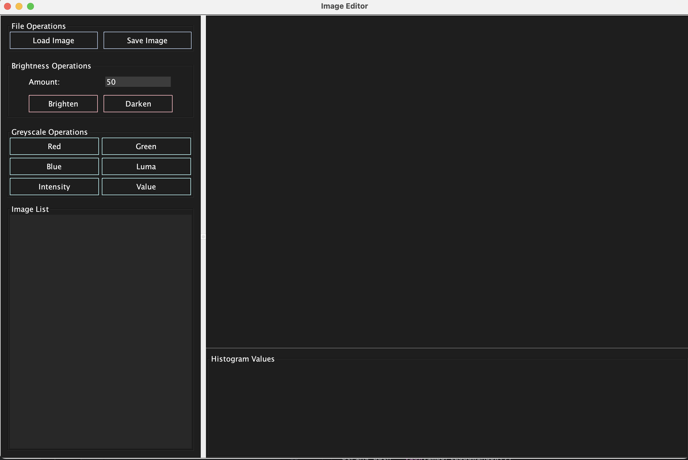

# Image Manipulation & Enhancement (IME)

A desktop image editor built in Java with Swing, designed around MVC architecture and extensible via the Command, Strategy, and Factory design patterns. Supports PPM, PNG, JPEG, and BMP formats with a live color histogram.


## Features

- **Load and save** images in PPM, PNG, JPEG, and BMP formats
- **Brightness controls** — brighten or darken by a custom amount
- **Six greyscale modes** — red, green, blue, value, intensity, and luma component extraction
- **Live histogram** — RGB + intensity channel visualization updates on every operation
- **Image list** — work with multiple images in a single session

## What I Focused On

- **Extensibility** — adding a new image operation means writing one class that implements `IOperation`; no changes to controller or view
- **Separation of concerns** — the View holds zero application logic and communicates with the Controller only through the `ViewListener` interface
- **Immutability** — image operations return new `IImage` copies via `editedImage()`, preserving the original
- **Multi-format support** — Reader/Writer factories abstract format differences so the rest of the app is format-agnostic



## Architecture

The application follows MVC with three supporting design patterns:

```
src/
├── IMEProgram.java                  → Entry point, wires Model-View-Controller
├── controller/
│   ├── ImageController.java         → Command execution engine
│   ├── ImageDatabase.java           → In-memory image storage (Model)
│   └── commands/                    → Command pattern — one class per operation
│       ├── Command.java             → Command interface
│       ├── BrightenCommand.java
│       ├── LoadCommand.java
│       ├── SaveCommand.java
│       └── ...greyscale commands
├── model/
│   ├── image/
│   │   ├── IImage.java              → Image interface (immutable copies on edit)
│   │   ├── Image.java               → Concrete image backed by Pixel[][]
│   │   └── Pixel.java               → RGB pixel with clamped values
│   ├── operations/
│   │   ├── IOperation.java          → Strategy interface — all filters implement this
│   │   ├── greyscale/               → Six greyscale strategies + abstract base
│   │   └── light/                   → Brighten and Darken operations
│   ├── abstraction/
│   │   ├── reader/                  → Factory pattern — format-specific readers
│   │   └── writer/                  → Factory pattern — format-specific writers
│   └── histogram/                   → RGB channel frequency computation
└── view/
    ├── View.java                    → JFrame GUI — panels, buttons, image list
    ├── HistogramView.java           → Custom JPanel for drawing histograms
    ├── ViewController.java          → Translates GUI events into Commands
    └── ViewListener.java            → Observer interface for View→Controller
```

**Design patterns used:**
- **Command** — each operation (load, save, brighten, greyscale) is encapsulated in its own class, decoupling the controller from execution logic
- **Strategy** — all image transformations implement `IOperation.apply(IImage)`, making filters interchangeable
- **Factory** — `ReaderFactory` and `WriterFactory` abstract file format handling, so adding a new format requires zero changes to existing code

## Tech Stack

**Language:** Java  
**GUI:** Swing (JFrame, JPanel, JList, JFileChooser)  
**Patterns:** MVC, Command, Strategy, Factory  
**Build:** javac / IDE (IntelliJ)

## Run It

```bash
git clone https://github.com/helloalara2025/image-editor.git
cd image-editor
javac -d out src/**/*.java
java -cp out IMEProgram
```

Or open in IntelliJ and run `IMEProgram.java`.
